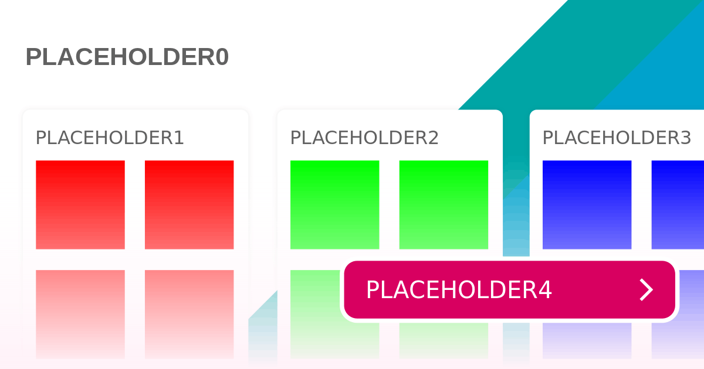
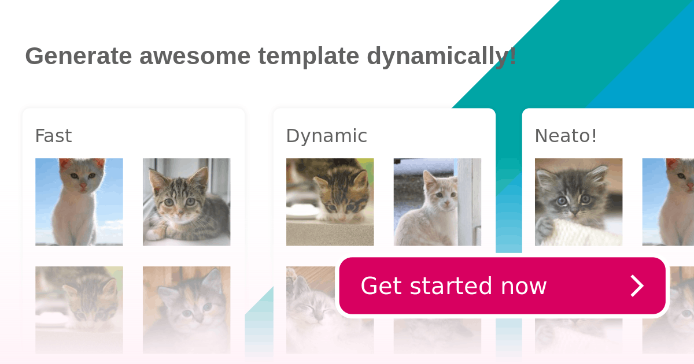

# Image templater

Are you sick of manually creating social media `og:image`s? Why not create
SVG templates and have your server generate them automatically.

Image templater is a library to make it easier to replace parts of an SVG image
dynamically.

## Usage

There are two steps:

1. Create a SVG template
2. Write some code to insert the values you want

## Making a template

The image templater can replace **text** and **images**. You should leave space
for these with certain stylistic markers.

- **Text:** Place a text element normally, but set the _value_ to a variable name.
  The variable name can be anything, but we suggest `BIG_BOLD_VARIABLES` so it's
  clear that variable should be replaced in code.
- **Images:** Position your images as placeholder rectangles. A developer can
  replace these with images of the same dimension. Set a unique colour for each
  image, or group similar images by colour.

An example template:



## Inserting the values

Once the template is made, you should:

1. Decide which data needs to be inserted where. See the [Making a template](#making-a-template)
   section to understand how to query different data types.
2. Use the library to insert your values

The previous example template with values filled in:



## Example code

There is a working example in the [examples/](examples) folder.

```js
// Import the correct version of the library. The NodeJS version reads the file
// from disk.
const SVGTemplateNode = require("../src/SVGTemplateNode");

// Create a new template instance.
const template = new SVGTemplateNode(
  path.join(__dirname, "./cards-template.svg")
);

// Replace some placeholder text. SVGTemplate methods are chainable
template
  .replaceText("PLACEHOLDER0", "Generate awesome template dynamically!")
  .replaceText("PLACEHOLDER1", "Fast")
  .replaceText("PLACEHOLDER2", "Dynamic")
  .replaceText("PLACEHOLDER3", "Neato!")
  .replaceText("PLACEHOLDER4", "Get started now");

// Replace a rectangle with #ff0000 in the style with a placekitten.
template.replaceImageByAttribute(
  // Attribute
  "style",

  // value to match
  "ff0000",

  // image url to replace
  `https://placekitten.com/${size}/${size}`,

  // index, defaults to 0 but useful if you have more than one of this attribute
  0
);

// Wait for any images to finish downloding
template.sync().then((template) => {
  // Log out our complete template
  console.log(String(template));
});
```

## Status & contributing

This was a weekend project, but it may be useful for you. It's a more practical
version of [svg-recolour](https://github.com/AshKyd/svg-recolour);

If you have any suggestions or want to contribute a frontend version, please
send a PR!
